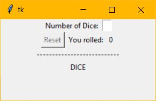
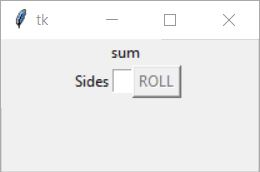

# Dice Rolling Game

## Overview
This project is a Python-based graphical application designed to simulate a dice rolling game between multiple players. The program consists of several modular components, each encapsulating specific functionalities. The user accesses the game by running the program dicegui.py. A window pops up on the screen where the user will be prompted to enter the number of dice they want to roll. After pressing enter, the user will be asked how many sides the die will have. The value of the die after being rolled will be shown on the right side of the screen which is summed up at the end of the round. This project attempts to create a user-friendly environment by providing the ability to control individual dice while also offering a feature for managing multiple dice collectively.

## How to Install
1. Download the code from Github and open it in your preferred code editor (e.g. Visual Studio Code)
2. Run the dicegui.py from terminal.
3. A window will pop up prompting you to input the number of dice you would like to simulate. Click the enter key.
4. Another window will pop up asking for the user input on the number of sides there should be on a die. Click the enter key and press the roll button various times
5. The sum of the values of each dice roll is calculated and the player with the highest sum wins.

## Visual Aid

 
  

Image on the left depicts the starting window and the image on the right depicts the secondary window that pops up upon inputting the number of dice.

## Credits
- Partner: Amy Havill
- Links to websites I found useful:
  - [Python Documentation on tkinter](https://docs.python.org/3/library/tkinter.html)
  - [GeeksforGeeks Python GUI: tkinter](https://www.geeksforgeeks.org/python-gui-tkinter/)
  - [FreeBootCamp Video on Python Tkinter GUI Design](https://www.youtube.com/watch?v=0tM-l_ZsxjU)

