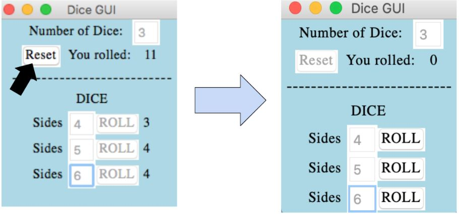

# Dice Rolling Game

## Overview
This project is a Python-based graphical application designed to simulate a dice rolling game between multiple players. The program consists of several modular components, each encapsulating specific functionalities. The user accesses the game by running the program dicegui.py. A window pops up on the screen where the user will be prompted to enter the number of dice they want to roll. After pressing enter, the user will be asked how many sides the die will have. The value of the die after being rolled will be shown on the right side of the screen which is summed up at the end of the round. This project attempts to create a user-friendly environment by providing the ability to control individual dice while also offering a feature for managing multiple dice collectively.

## How to Install
1. Download the code from Github and open it in your preferred code editor (e.g. Visual Studio Code).
2. Check if your desktop has the latest python application installed. If not, install it.
3. Run the dicegui.py from terminal.
4. A window will pop up prompting you to input the number of dice you would like to simulate. Click the enter key.
5. Another window will pop up asking for the user input on the number of sides there should be on a die. Click the enter key and press the roll button various times
6. The sum of the values of each dice roll is calculated and the player with the highest sum wins.

## How to Play
1. Enter the amount of die/dice to be generated and press <Enter>. The number die/dice be a whole integer greater than 0.
   

    
   

2. Enter the amount of sides per die and press <Enter> after each entry. The number sides must be a whole integer greater than three.
   

    
   
 
3. Press the ROLL button for each dice. A random integer between one and the number of sides will appear to the right. These numbers will then be summed and displayed in the area circled below.
   

    
   

4. Press the Reset button to clear the sum and reset the die/dice.
   

    
   

5. Continue to play the game by pressing the “ROLL” buttons. (Note: Number of dice cannot be changed once set. In order to change the number of dice, you will have to run the entire module again.

## Troubleshooting
1. Module is not running  
      - Download a version of Python 3 at [Python Download Link](https://www.python.org/downloads/)  
      - Collect all modules and required files in the same directory.
2. Nothing happens after inputting a number for “Number of Dice: ”? 
      - Press <Enter> after inputting a number to generate the die/dice  
3. ROLL button not working
   - Press <Enter> after inputting the number of sides per die to enable to ROLL button 
4. Reset button not working 
   - All entry boxes must be filled out and all die/dice must be rolled to enable the Reset button 
5. Error message appears after inputting a value for “Number of Dice: ”

 

6. Error message appears after inputting a value for “Sides: ”? 

 

## Credits
- Partner: Amy Havill
- Links to websites I found useful:
  - [Python Download Link](https://www.python.org/downloads/)
  - [Python Documentation on tkinter](https://docs.python.org/3/library/tkinter.html)
  - [GeeksforGeeks Python GUI: tkinter](https://www.geeksforgeeks.org/python-gui-tkinter/)
  - [FreeBootCamp Video on Python Tkinter GUI Design](https://www.youtube.com/watch?v=0tM-l_ZsxjU)

